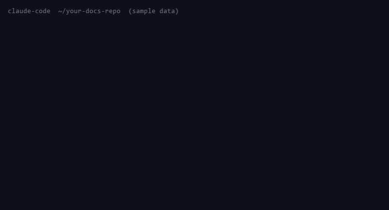

# SSOT Check

There is also a tool-backed standalone: [ssot-check](https://github.com/conorbronsdon/ssot-check) — a deterministic stdlib CLI with a JSON Schema, a pre-commit hook, and a GitHub Action. Prefer it when you want checks that are reproducible and CI-enforceable.

This directory is a **separate prose skill**, not a synced copy of that repo. The two share a name and a problem statement and have diverged; neither tracks the other. Use this one when you want a model to do the judgment work — curating a manifest from scratch, deciding which file is canonical, reading a report — without installing anything.

Single-source-of-truth drift auditor for documentation-heavy repos. Facts like an episode count, a price, or a subscriber number are canonical in one file but hand-copied into others (media kits, READMEs, landing pages). Copies drift. `/ssot-check` discovers those facts, records canonical locations in a `.ssot.yaml` manifest, and verifies every copy on each run. Drifted copies get proposed diffs, never silent edits.

Two modes: **discover** (first run, proposes the manifest) and **check** (every run after, verifies copies and emits a one-line exit summary suitable for a pre-commit habit).

See [SKILL.md](SKILL.md) for full instructions and the manifest schema. A worked example from a real discover run — the proposed manifest plus the live drift it surfaced — is in [examples/cot-production-discovery/](examples/cot-production-discovery/).
